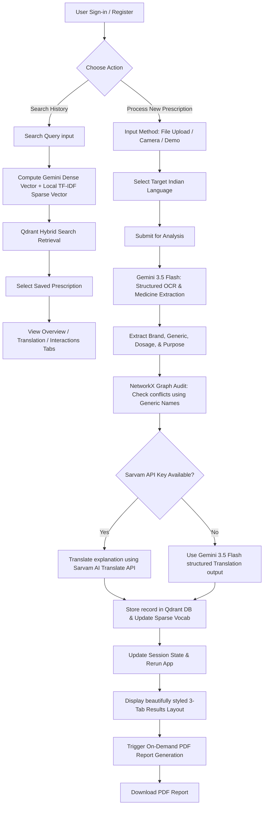

# PresciMate Technical Architecture & Workflow Overview

PresciMate is an AI-powered medical prescription helper designed to parse handwritten or printed doctors' prescriptions, extract medication details, audit potential drug-drug interactions, translate instructions into 12 major Indian languages, and export professional PDF explanation reports.

---

## 🛠️ Technology Stack

The application leverages a hybrid architectural pattern of modern LLM APIs, semantic vector databases, and traditional graph theory:

### 1. Frontend & Application Layer
* **Streamlit**: Serves as the web dashboard framework. Utilizes advanced session state tracking, interactive file uploads, integrated camera input support, and dynamic navigation.
* **Custom Vanilla CSS**: Embedded via `st.markdown(..., unsafe_allow_html=True)` to deliver a polished, dark/light-harmonious medical theme using the Google Font **Outfit**, clean card components, custom-colored interaction severity banners, and responsive layouts.

### 2. Core AI and Natural Language Processing
* **Google Gemini API (`gemini-3.5-flash`)**: 
  * Performs Multimodal Optical Character Recognition (OCR) and structured data extraction.
  * Utilizes structured JSON output enforcement with a Pydantic schema (`MedicationDetail` and `PrescriptionAnalysis`) to extract medication brand name, generic name, dosage instructions, and purpose in a single pass.
  * Acts as a translation fallback engine.
* **Google Gemini Embeddings (`models/gemini-embedding-001`)**: Used to create 768-dimensional dense vectors from stored prescription logs for semantic search.

### 3. Database & Retrieval (Hybrid Search Vector DB)
* **Qdrant Vector Database**: Configured in-memory for lock-free stability and hot-reload compliance. It indexes two separate collections:
  * `users`: For secure user storage.
  * `prescriptions`: Powered by a **Hybrid Search** schema that combines:
    * **Dense Vectors** (Gemini embeddings) for semantic concept searches.
    * **Sparse Vectors** (a custom local TF-IDF vectorizer storing vocabulary states in [vocab.json](file:///c:/prescimate-sample/vocab.json)) for exact keyword matching (e.g. searching specific drug names like "Aspirin").

### 4. Logic & Computation Layers
* **NetworkX (Graph RAG)**: Models drug-drug interactions as a bidirectional node-edge graph. Drug generic names serve as nodes, while edges represent known conflicts embedded with severity levels (`Major` or `Moderate`) and physiological descriptions (e.g., *Warfarin + Aspirin* or *Metformin + Iodine Contrast*).
* **Sarvam AI Translation API**: Translates English explanations into native scripts (Devanagari, Tamil, Telugu, etc.) for 12 regional languages.
* **ReportLab PDF Engine**: Dynamically creates professional multi-page explanation reports. Registers and loads Google Noto TrueType fonts on demand to prevent rendering boxes for Indian scripts.
* **Bcrypt**: Used for secure client-side password hashing before database storage.

---

## 🔄 End-to-End Application Workflow

Below is the step-by-step pipeline mapping how a user interacts with the app and how data flows through the backend:

### Process Details

#### 1. Authentication
* Users are managed locally. Passwords are encrypted with `bcrypt` salt rounds and verified against the Qdrant `users` collection. Session state restricts workspace visibility to the active user.

#### 2. Prescription Ingestion
* The frontend accepts standard image formats (JPEG, PNG, JPG). For testing without hardware, the system includes a predefined **Demo/Sample Prescription** rendering mock medicine lists (*Ecosprin 75mg*, *Warfarin 5mg*, *Glycomet 500mg*, *Lipvas 10mg*) dynamically created via `PIL.ImageDraw`.

#### 3. Structured Extraction & Audit
* The raw image is passed to `gemini-3.5-flash`. The model responds in exact JSON format mapping to a Pydantic structure.
* Extracted generic names are converted to lowercase and looked up in the **NetworkX** interaction graph. If match pairs exist, metadata (e.g. "Major Bleeding Risk") is flagged and highlighted in red or amber alerts.

#### 4. Multilingual Translation
* Explanations are translated to the target script. If the `SARVAM_API_KEY` is present, it calls the `sarvam.ai` endpoint. Otherwise, it extracts the pre-translated field created during the single-pass Gemini API call.

#### 5. Storage & PDF Compilation
* The processed record is saved to Qdrant. The text contents are tokenized by `LocalSparseVectorizer` to update the local vocabulary and document frequencies.
* If the user clicks **Download Explanation Report (PDF)**, the PDF engine fetches the correct font (e.g., *NotoSansDevanagari-Regular.ttf* for Hindi/Marathi) from GitHub, caches it in [fonts/](file:///c:/genai/apps/prescimate/fonts) to avoid redundant requests, builds a ReportLab flowable storyboard, and pushes it as a downloadable binary.
